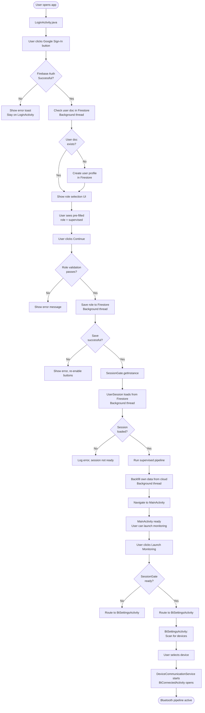

## 🔀 High-Level Flowcharts

### Flow 1: Login → MainActivity (Supervised User)

```mermaid
flowchart TD
    Start([User opens app]) --> Login[LoginActivity.java]
    Login --> SignIn[User clicks Google Sign-In button]
    SignIn --> Auth{Firebase Auth<br/>Successful?}
    Auth -->|No| ShowError[Show error toast<br/>Stay on LoginActivity]
    Auth -->|Yes| CheckFirestore[Check user doc in Firestore<br/>Background thread]
    
    CheckFirestore --> UserExists{User doc<br/>exists?}
    UserExists -->|No| CreateProfile[Create user profile<br/>in Firestore]
    UserExists -->|Yes| ShowRoleUI[Show role selection UI]
    CreateProfile --> ShowRoleUI
    
    ShowRoleUI --> WaitRole[User sees pre-filled<br/>role = supervised]
    WaitRole --> ClickProceed[User clicks Continue]
    ClickProceed --> ValidateSupervised{Role validation<br/>passes?}
    ValidateSupervised -->|No| ShowValidationError[Show error message]
    ValidateSupervised -->|Yes| SaveRole[Save role to Firestore<br/>Background thread]
    
    SaveRole --> SaveSuccess{Save<br/>successful?}
    SaveSuccess -->|No| ShowSaveError[Show error, re-enable buttons]
    SaveSuccess -->|Yes| InitSessionGate[SessionGate.getInstance]
    
    InitSessionGate --> LoadSession[UserSession loads from Firestore<br/>Background thread]
    LoadSession --> SessionLoaded{Session<br/>loaded?}
    SessionLoaded -->|No| SessionError[Log error, session not ready]
    SessionLoaded -->|Yes| BootstrapSupervised[Run supervised pipeline]
    
    BootstrapSupervised --> BackfillSupervised[Backfill own data from cloud<br/>Background thread]
    BackfillSupervised --> NavMain[Navigate to MainActivity]
    NavMain --> MainReady[MainActivity ready<br/>User can launch monitoring]
    MainReady --> LaunchMonitoring[User clicks Launch Monitoring]
    LaunchMonitoring --> CheckSession{SessionGate<br/>ready?}
    CheckSession -->|No| FallbackBT[Route to BtSettingsActivity]
    CheckSession -->|Yes| RouteBT[Route to BtSettingsActivity]
    
    RouteBT --> BtSettings[BtSettingsActivity:<br/>Scan for devices]
    BtSettings --> Connect[User selects device]
    Connect --> BtConnected[DeviceCommunicationService starts<br/>BtConnectedActivity opens]
    BtConnected --> End([Bluetooth pipeline active])
```

### Flow 2: Login → MainActivity (Supervisor User)

```mermaid
flowchart TD
    Start([User opens app]) --> Login[LoginActivity.java]
    Login --> SignIn[User clicks Google Sign-In button]
    SignIn --> Auth{Firebase Auth<br/>Successful?}
    Auth -->|No| ShowError[Show error toast<br/>Stay on LoginActivity]
    Auth -->|Yes| CheckFirestore[Check user doc in Firestore<br/>Background thread]
    
    CheckFirestore --> UserExists{User doc<br/>exists?}
    UserExists -->|No| CreateProfile[Create user profile<br/>in Firestore]
    UserExists -->|Yes| ShowRoleUI[Show role selection UI]
    CreateProfile --> ShowRoleUI
    
    ShowRoleUI --> WaitRole[User sees pre-filled<br/>role = supervisor<br/>email field shown]
    WaitRole --> TypeEmail[User types/selects<br/>supervised email]
    TypeEmail --> Autocomplete[Firestore query for<br/>supervised users<br/>Background thread]
    Autocomplete --> ClickProceed[User clicks Continue]
    
    ClickProceed --> ValidateSupervisor{Email validation<br/>passes?}
    ValidateSupervisor -->|No| ShowValidationError[Show error: email required/invalid]
    ValidateSupervisor -->|Yes| SaveRole[Save role + supervisedEmail<br/>to Firestore<br/>Background thread]
    
    SaveRole --> SaveSuccess{Save<br/>successful?}
    SaveSuccess -->|No| ShowSaveError[Show error, re-enable buttons]
    SaveSuccess -->|Yes| InitSessionGate[SessionGate.getInstance]
    
    InitSessionGate --> LoadSession[UserSession loads from Firestore<br/>Background thread]
    LoadSession --> ResolveEmail[Resolve supervised email<br/>to UID<br/>Background thread]
    ResolveEmail --> SessionLoaded{Session<br/>loaded?}
    SessionLoaded -->|No| SessionError[Log error, session not ready]
    SessionLoaded -->|Yes| BootstrapSupervisor[Run supervisor pipeline]
    
    BootstrapSupervisor --> PurgeOld[Delete old data<br/>not belonging to<br/>current supervised users]
    PurgeOld --> BackfillEach[For each supervised UID:<br/>Backfill data from cloud<br/>Background thread]
    BackfillEach --> StartMirrors[Start real-time mirrors<br/>for each supervised UID]
    StartMirrors --> NavMain[Navigate to MainActivity]
    
    NavMain --> MainReady[MainActivity ready<br/>User can launch monitoring]
    MainReady --> LaunchMonitoring[User clicks Launch Monitoring]
    LaunchMonitoring --> CheckSession{SessionGate<br/>ready?}
    CheckSession -->|No| FallbackBT[Route to BtSettingsActivity]
    CheckSession -->|Yes| RouteDirect[Skip BT scanning<br/>Route to BtConnectedActivity]
    
    RouteDirect --> BtConnected[BtConnectedActivity:<br/>Shows latest posture<br/>from Room database]
    BtConnected --> End([Monitoring active<br/>Real-time updates via mirrors])
```
