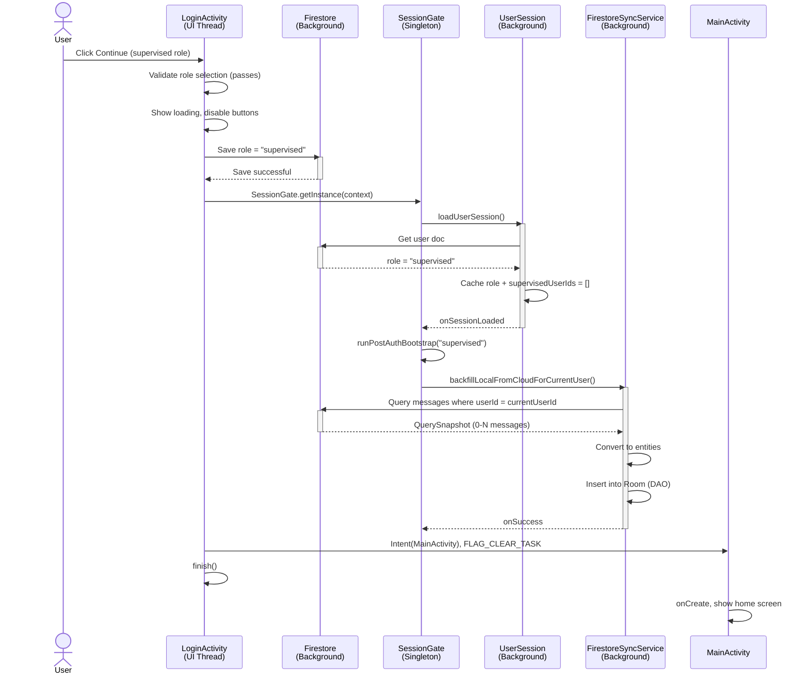
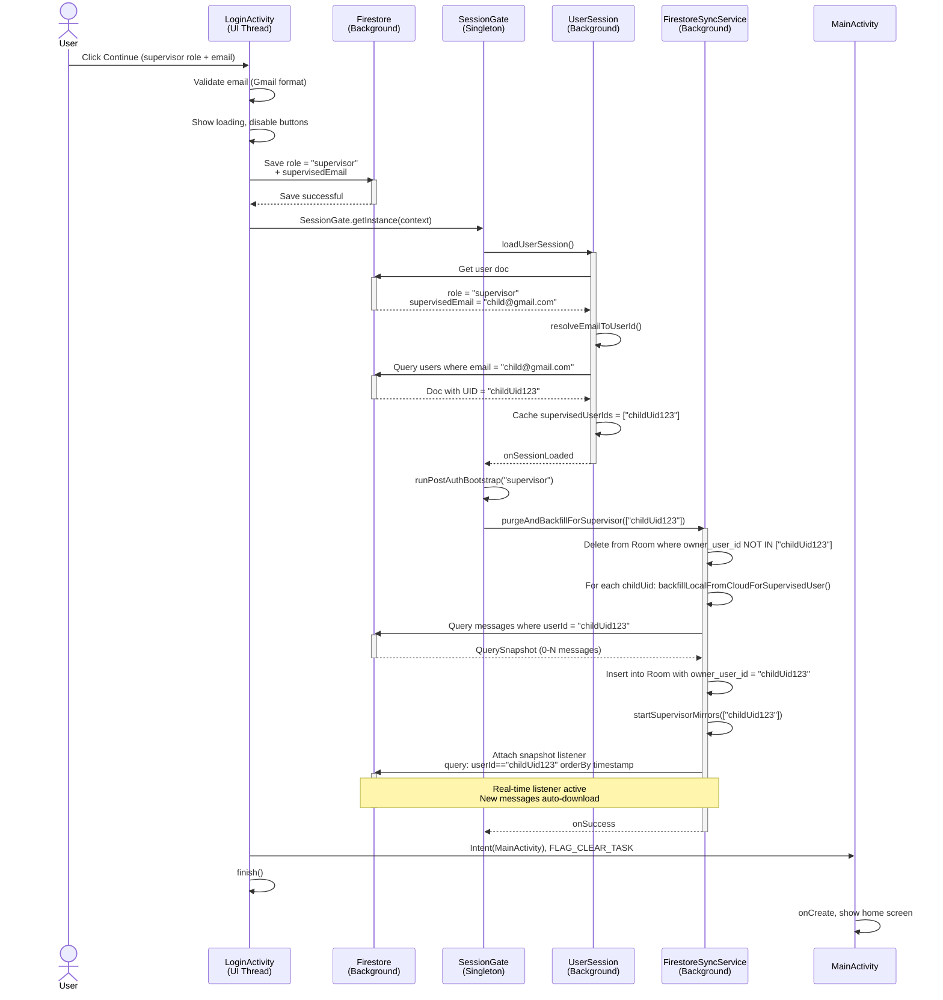
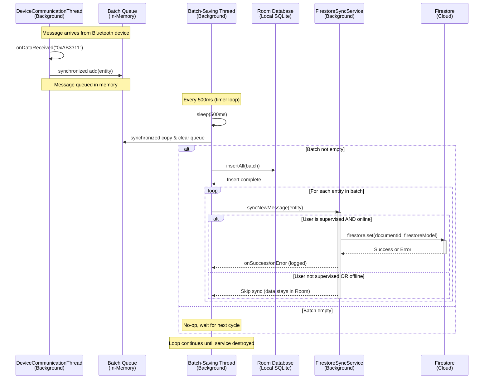

## 🔁 Sequence Diagrams

### Diagram 1: onProceed() – Supervised User

```mermaid
sequenceDiagram
    actor User
    participant UI as LoginActivity<br/>(UI Thread)
    participant FS as Firestore<br/>(Background)
    participant SG as SessionGate<br/>(Singleton)
    participant US as UserSession<br/>(Background)
    participant Sync as FirestoreSyncService<br/>(Background)
    participant Main as MainActivity
    
    User->>UI: Click Continue (supervised role)
    UI->>UI: Validate role selection (passes)
    UI->>UI: Show loading, disable buttons
    UI->>FS: Save role = "supervised"
    activate FS
    FS-->>UI: Save successful
    deactivate FS
    
    UI->>SG: SessionGate.getInstance(context)
    SG->>US: loadUserSession()
    activate US
    US->>FS: Get user doc
    activate FS
    FS-->>US: role = "supervised"
    deactivate FS
    US->>US: Cache role + supervisedUserIds = []
    US-->>SG: onSessionLoaded
    deactivate US
    
    SG->>SG: runPostAuthBootstrap("supervised")
    SG->>Sync: backfillLocalFromCloudForCurrentUser()
    activate Sync
    Sync->>FS: Query messages where userId = currentUserId
    activate FS
    FS-->>Sync: QuerySnapshot (0-N messages)
    deactivate FS
    Sync->>Sync: Convert to entities
    Sync->>Sync: Insert into Room (DAO)
    Sync-->>SG: onSuccess
    deactivate Sync
    
    UI->>Main: Intent(MainActivity), FLAG_CLEAR_TASK
    UI->>UI: finish()
    Main->>Main: onCreate, show home screen
```

### Diagram 2: onProceed() – Supervisor User

```mermaid
sequenceDiagram
    actor User
    participant UI as LoginActivity<br/>(UI Thread)
    participant FS as Firestore<br/>(Background)
    participant SG as SessionGate<br/>(Singleton)
    participant US as UserSession<br/>(Background)
    participant Sync as FirestoreSyncService<br/>(Background)
    participant Main as MainActivity
    
    User->>UI: Click Continue (supervisor role + email)
    UI->>UI: Validate email (Gmail format)
    UI->>UI: Show loading, disable buttons
    UI->>FS: Save role = "supervisor"<br/>+ supervisedEmail
    activate FS
    FS-->>UI: Save successful
    deactivate FS
    
    UI->>SG: SessionGate.getInstance(context)
    SG->>US: loadUserSession()
    activate US
    US->>FS: Get user doc
    activate FS
    FS-->>US: role = "supervisor"<br/>supervisedEmail = "child@gmail.com"
    deactivate FS
    US->>US: resolveEmailToUserId()
    US->>FS: Query users where email = "child@gmail.com"
    activate FS
    FS-->>US: Doc with UID = "childUid123"
    deactivate FS
    US->>US: Cache supervisedUserIds = ["childUid123"]
    US-->>SG: onSessionLoaded
    deactivate US
    
    SG->>SG: runPostAuthBootstrap("supervisor")
    SG->>Sync: purgeAndBackfillForSupervisor(["childUid123"])
    activate Sync
    Sync->>Sync: Delete from Room where owner_user_id NOT IN ["childUid123"]
    Sync->>Sync: For each childUid: backfillLocalFromCloudForSupervisedUser()
    Sync->>FS: Query messages where userId = "childUid123"
    activate FS
    FS-->>Sync: QuerySnapshot (0-N messages)
    deactivate FS
    Sync->>Sync: Insert into Room with owner_user_id = "childUid123"
    Sync->>Sync: startSupervisorMirrors(["childUid123"])
    Sync->>FS: Attach snapshot listener<br/>query: userId=="childUid123" orderBy timestamp
    activate FS
    Note over Sync,FS: Real-time listener active<br/>New messages auto-download
    deactivate FS
    Sync-->>SG: onSuccess
    deactivate Sync
    
    UI->>Main: Intent(MainActivity), FLAG_CLEAR_TASK
    UI->>UI: finish()
    Main->>Main: onCreate, show home screen
```

### Diagram 3: Bluetooth Message Pipeline (500ms Batch Cycle)

```mermaid
sequenceDiagram
    participant BT as DeviceCommunicationThread<br/>(Background)
    participant Q as Batch Queue<br/>(In-Memory)
    participant Saver as Batch-Saving Thread<br/>(Background)
    participant Room as Room Database<br/>(Local SQLite)
    participant Sync as FirestoreSyncService<br/>(Background)
    participant FS as Firestore<br/>(Cloud)
    
    Note over BT,Q: Message arrives from Bluetooth device
    BT->>BT: onDataReceived("0xAB3311")
    BT->>Q: synchronized add(entity)
    Note over BT,Q: Message queued in memory
    
    Note over Saver: Every 500ms (timer loop)
    Saver->>Saver: sleep(500ms)
    Saver->>Q: synchronized copy & clear queue
    alt Batch not empty
        Saver->>Room: insertAll(batch)
        Room-->>Saver: Insert complete
        
        loop For each entity in batch
            Saver->>Sync: syncNewMessage(entity)
            activate Sync
            
            alt User is supervised AND online
                Sync->>FS: firestore.set(documentId, firestoreModel)
                activate FS
                FS-->>Sync: Success or Error
                deactivate FS
                Sync-->>Saver: onSuccess/onError (logged)
            else User not supervised OR offline
                Sync-->>Saver: Skip sync (data stays in Room)
            end
            deactivate Sync
        end
    else Batch empty
        Note over Saver: No-op, wait for next cycle
    end
    
    Note over Saver: Loop continues until service destroyed
```
