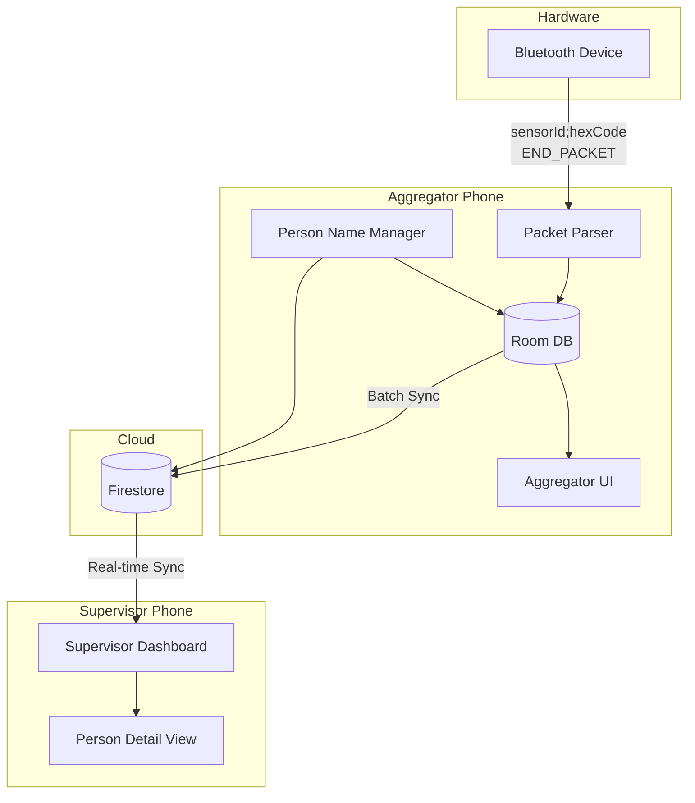
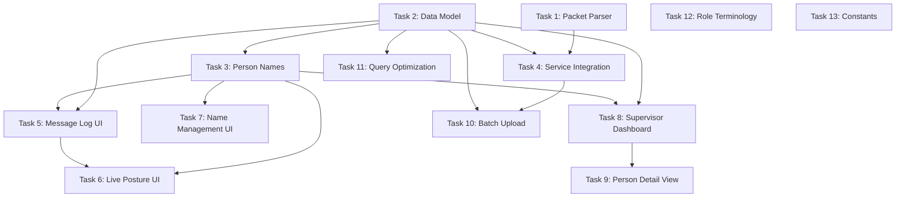

# Multi-User Posture Monitoring System - Task Overview

This folder contains the breakdown of the Multi-User Posture Monitoring System specification into discrete, assignable development tasks.

## Architecture Overview

---

## Task List

| Task | Description | Effort | Dependencies |
|------|-------------|--------|--------------|
| [Task 1](./01-packet-parser.md) | Multi-User Packet Parser | 2-3 days | None |
| [Task 2](./02-data-model.md) | Data Model Extension | 2-3 days | None |
| [Task 3](./03-person-names.md) | Monitored Person Entity & Name Management | 2 days | Task 2 |
| [Task 4](./04-service-integration.md) | DeviceCommunicationService Integration | 2-3 days | Task 1, 2 |
| [Task 5](./05-message-log-ui.md) | Aggregator UI - Live Message Monitor | 3-4 days | Task 2, 3 |
| [Task 6](./06-live-posture-ui.md) | Aggregator UI - Live Posture Viewer | 2-3 days | Task 3, 5 |
| [Task 7](./07-name-management-ui.md) | Person Name Management UI | 2 days | Task 3 |
| [Task 8](./08-supervisor-dashboard.md) | Supervisor Multi-Person Dashboard | 3-4 days | Task 2, 3 |
| [Task 9](./09-person-detail-view.md) | Individual Person Detail View | 1-2 days | Task 8 |
| [Task 10](./10-batch-upload.md) | Firestore Batch Upload Optimization | 2-3 days | Task 2, 4 |
| [Task 11](./11-query-optimization.md) | Supervisor Query Optimization | 1-2 days | Task 2 |
| [Task 12](./12-role-terminology.md) | Role Terminology Update | 1 day | None |
| [Task 13](./13-constants.md) | Constants and Configuration | 0.5 days | All |

---

## Task Dependency Graph

---

## Team Assignment Recommendations

| Developer Role | Recommended Tasks |
|---------------|-------------------|
| Bluetooth/Backend Dev 1 | Task 1, Task 4 |
| Backend/Database Dev | Task 2, Task 3, Task 10, Task 11 |
| UI Developer 1 | Task 5, Task 6, Task 7 |
| UI Developer 2 | Task 8, Task 9 |
| Any/Cleanup | Task 12, Task 13 |

---

## Sprint Planning Suggestion

**Sprint 1 (Week 1-2):** Tasks 1, 2, 3 (Foundation)  
**Sprint 2 (Week 2-3):** Tasks 4, 5, 6, 7 (Aggregator Complete)  
**Sprint 3 (Week 3-4):** Tasks 8, 9, 10, 11, 12, 13 (Supervisor + Polish)
